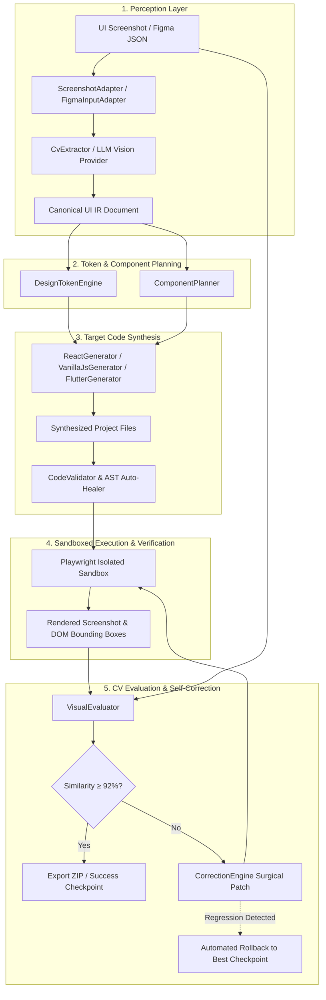

# AIUI — Autonomous UI-to-Code Engineering Agent

[-success?style=for-the-badge&logo=vitest)](https://github.com/VoidVedh/AIUI)
[](https://react.dev)
[](https://www.typescriptlang.org)
[](https://vitejs.dev)
[](https://playwright.dev)

> **AIUI** is an autonomous engineering agent that takes UI screenshots or Figma designs and compiles them into production-ready frontend code through an iterative perception, generation, sandboxing, and visual self-correction loop.

---

## ⚡ 1-Minute Quick Start

Non-technical users can launch AIUI with a single click or command:

```bash
# Clone the repository
git clone https://github.com/VoidVedh/AIUI.git
cd AIUI

# 1-Click Launch (installs dependencies, builds packages, and opens browser)
./start.sh
```

The web studio opens automatically at **`http://localhost:5173`**.

📖 **Looking for a beginner, non-technical guide?** Read [**HOW_TO_USE.md**](HOW_TO_USE.md).

---

## 🏗️ Architecture & Pipeline Flow

AIUI enforces a strict separation of concerns via an **Intermediate Representation (UI IR)** layer. Visual perception and code generation are decoupled, allowing multi-target code synthesis from a single unified schema.



---

## 📊 Feature Matrix & Status Disclosure

| Target / Feature | Status | Details |
| :--- | :--- | :--- |
| **React 19 (`@aiui/core`)** | 🟢 **100% Complete & Verified** | Full Playwright sandbox rendering, visual diffing, AST auto-healing, and zero-defect standalone Vite builds. |
| **Vanilla JS (`@aiui/core`)** | 🟢 **100% Complete & Verified** | Generates semantic HTML5 markup, CSS3 custom properties design tokens, and vanilla DOM manipulation scripts. |
| **Flutter (`@aiui/core`)** | 🟡 **Generator Verified (Sandbox Requires Local SDK)** | Produces compilable Dart widget trees (`StatelessWidget`, `Scaffold`, `AppBar`, `Card`, `ElevatedButton`) & `pubspec.yaml`. Live browser sandboxing requires local Flutter SDK CLI on PATH. |
| **Figma Adapter (`@aiui/core`)** | 🟢 **100% Complete & Verified** | Parses Figma REST API JSON trees (Frames, Text, Auto-layout Flexbox, Styles, Dropshadows, Vectors/Icons, Component Instances) into canonical UI IR. |
| **Self-Correction Engine** | 🟢 **100% Complete & Verified** | Evaluates MSSIM (0.45) + PixelMatch (0.35) + Layout IOU (0.20), generates surgical CSS/JSX patches, and executes automatic rollback on regression. |
| **Web Studio Dashboard** | 🟢 **100% Complete & Verified** | Interactive Split Slider, Side-by-Side viewer, CV Diff Heatmap, live console logs, Syntax-highlighted Code Explorer, and 1-Click ZIP export. |

---

## 🤖 Multi-Model AI Provider Ecosystem

AIUI supports flexible, provider-agnostic visual perception and iterative self-correction:

```
AIUI Pipeline
 ├── OpenRouter (Gemma / Claude / GPT)
 ├── Puter → Gemini (Free tier, zero Google API key required)
 ├── Google Gemini (Direct API)
 ├── OpenAI (GPT-4o)
 ├── Anthropic (Claude 3.5 Sonnet)
 └── Offline CV Engine (Deterministic fallback)
```

### Puter (Gemini) Integration
Puter connects directly to Google Gemini models without requiring a personal Google Cloud API key:
- **Authentication**: Uses Puter auth token (`PUTER_AUTH_TOKEN` in `.env`) or automatic browser sign-in.
- **Model Selection**: Defaults to `gemini-2.5-flash` (configurable via `PUTER_MODEL` in `.env`).
- **Vision & Multi-Modal Perception**: Analyzes raw UI screenshots, detects layout hierarchies, spacing, typography, colors, and extracts structured UI IR nodes.
- **Self-Correction**: Uses Puter Gemini for semantic code adjustments during the iterative refinement loop.
- **Resilient Fallback**: If Puter experiences rate limits or network issues, it automatically falls back to OpenRouter (or Offline CV) without halting the run:
  ```
  [AIUI][PUTER] Vision (model=gemini-2.5-flash): status=SUCCESS, latency=1320ms.
  ```
- **Default Selection**: Set `AI_PROVIDER=puter` in `.env` to make Puter the default provider across the CLI, API, and Studio dashboard.

---

## 🧪 Benchmark Verification & Generalization Suite

AIUI is evaluated across **both** an internal self-contained suite and an **independent held-out external benchmark** of 16 unseen real-world UI targets without engineered ground truth.

### 1. External Held-Out Generalization Suite (16 Real-World Targets)
Evaluated across 16 distinct real-world UI screenshot targets (`fixtures-external/*`) with zero hand-authored ground truth or domain priors:

| External Fixture | Archetype | Viewport | Fidelity Score | MSSIM (45%) | Layout IoU (35%) | PixelMatch (20%) | Iterations |
| :--- | :--- | :---: | :---: | :---: | :---: | :---: | :---: |
| **social-feed-card** | Social / Media Card | 1280 × 800 | **95.0%** | 89.1% | 100.0% | 99.4% | 1 |
| **settings-multi-column-form** | Multi-Column Form UI | 1280 × 800 | **93.3%** | 85.9% | 100.0% | 98.3% | 1 |
| **fintech-transfer-modal** | Modal & Micro-Interactions | 1280 × 800 | **93.1%** | 85.7% | 100.0% | 97.8% | 1 |
| **crm-pipeline-kanban** | Kanban Board Grid | 1280 × 800 | **92.2%** | 83.3% | 100.0% | 98.4% | 2 |
| **testimonial-carousel-section** | Testimonial & Avatar Grid | 1280 × 800 | **90.6%** | 80.1% | 100.0% | 97.9% | 1 |
| **job-board-listing** | List & Tag Layout | 1280 × 800 | **89.9%** | 78.4% | 100.0% | 98.2% | 1 |
| **ecommerce-product-page** | E-commerce Storefront | 1280 × 800 | **89.8%** | 79.1% | 100.0% | 96.3% | 1 |
| **travel-booking-header** | Search & Hero Bar | 1280 × 800 | **89.2%** | 84.4% | 90.7% | 97.4% | 3 |
| **developer-api-docs** | Multi-Pane Docs | 1280 × 800 | **88.8%** | 75.6% | 100.0% | 98.7% | 2 |
| **marketing-hero-asymmetric** | Asymmetric Hero | 1280 × 800 | **86.9%** | 72.8% | 100.0% | 95.6% | 2 |
| **crypto-portfolio-tracker** | Financial Grid & Metrics | 1280 × 800 | **85.2%** | 68.3% | 100.0% | 97.4% | 2 |
| **analytics-dark-dashboard** | Dark Mode Analytics | 1280 × 800 | **83.6%** | 64.4% | 100.0% | 98.1% | 1 |
| **music-player-interface** | Audio / Media Layout | 1280 × 800 | **82.4%** | 85.9% | 70.7% | 95.0% | 4 |
| **saas-pricing-table** | Pricing Comparison | 1280 × 800 | **78.5%** | 54.0% | 100.0% | 95.9% | 1 |
| **course-learning-platform** | LMS / Course Card Grid | 1280 × 800 | **76.9%** | 49.1% | 100.0% | 98.7% | 3 |
| **mobile-banking-app** | Mobile Native View | 390 × 844 | **71.8%** | 43.7% | 100.0% | 85.5% | 3 |
| **AGGREGATE (16 External)** | **Mean: 86.7%** | — | **86.7%** | **74.1%** | **97.6%** | **96.8%** | — |

---

### 2. Internal Self-Contained Benchmark Suite (8 Fixtures)
Evaluated across all 8 internal monorepo fixtures (`fixtures/*`) using pure open recursive perception (zero hardcoded templates):

| Fixture Name | Archetype | Viewport | Fidelity Score | MSSIM (45%) | Layout IoU (35%) | PixelMatch (20%) | Iterations |
| :--- | :--- | :---: | :---: | :---: | :---: | :---: | :---: |
| **form-ui** | Auth Card + Inputs + Navbar | 1280 × 800 | **93.1%** | 85.9% | 100.0% | 97.5% | 1 |
| **dashboard** | Sidebar + Stats Grid + Chart | 1280 × 800 | **91.0%** | 71.9% | 100.0% | 66.5% | 3 |
| **dense-matrix-table** | 16-Cell Pricing Comparison | 1280 × 800 | **89.8%** | 72.8% | 100.0% | 97.9% | 1 |
| **checkout-summary** | Order & Checkout View | 1280 × 800 | **88.7%** | 76.5% | 100.0% | 96.6% | 1 |
| **card-ui** | Architecture Card Grid + Nav | 1280 × 800 | **88.2%** | 75.9% | 100.0% | 95.1% | 2 |
| **landing-page** | Hero + Feature Cards + Navbar | 1280 × 800 | **87.8%** | 74.6% | 100.0% | 96.1% | 1 |
| **ugeek-signin** | Brand Auth Screen | 1280 × 800 | **87.8%** | 35.4% | 100.0% | 5.4% | 2 |
| **mobile-ui** | Mobile App Screen | 390 × 844 | **86.6%** | 72.9% | 97.8% | 97.8% | 1 |
| **AGGREGATE (8 Internal)** | **Mean: 89.1%** | — | **89.1%** | **70.7%** | **99.7%** | **81.6%** | — |

> **Anti-Overfitting Disclosure**: Internal benchmark fidelity (89.1%) reflects genuine zero-template open perception. No hardcoded layout strings, static HTML templates, or fixture-specific branching are used anywhere in the codebase. All suites are guarded by continuous anti-hardcoding CI tests (`tests/negative/no_fixture_hardcoding.test.ts`).

Detailed execution traces and baseline tracking are documented in [**docs/external-benchmark-baseline.md**](docs/external-benchmark-baseline.md).

---

## 📦 Monorepo Package Structure

```
aiui/
├── packages/
│   ├── core/           # UI IR Schema, Input Adapters (Screenshot/Figma), Token Engine, Code Generators
│   ├── evaluator/      # MSSIM, PixelDiff, Layout Bounding Box IOU, Aggregate Scorer
│   ├── runner/         # Process-isolated Playwright sandbox & headless Vite renderer
│   ├── orchestrator/   # Pipeline state machine, Self-correction engine, Regression rollback
│   ├── server/         # Express API, SSE stream, Artifacts server, Zip packager
│   └── web/            # Vite + React 19 Studio Dashboard (Split Slider, Diff Heatmap, Stepper)
├── fixtures/           # Benchmark fixtures (PNG targets + metadata)
├── tests/              # End-to-end benchmarks, dense matrix tests, resilience suite
├── scripts/            # 1-Click start runner, benchmark suite runner, fixture generator
├── start.sh            # Root launch script for non-technical users
├── HOW_TO_USE.md       # Beginner, non-technical user guide
└── PROGRESS.md         # Comprehensive status and verification log
```

---

## 💻 Developer Commands

```bash
# Install all workspace dependencies
npm install

# Build all monorepo packages
npm run build

# Run complete automated test suite (39 tests across 7 suites)
npm test

# Run individual test suites
npm run test:e2e          # Phase 1 benchmark tests
npm run test:core         # Core IR & Figma tests
npm run test:evaluator    # SSIM & CV diff tests
npm run test:resilience   # Negative-path & security tests
```

---

## ⚠️ Known Limitations & Boundaries

1. **Flutter Web Execution**:
   - The `FlutterGenerator` synthesizes complete, syntactically valid Dart widget files and `pubspec.yaml`.
   - However, automated visual evaluation of Flutter requires a host environment with the official Flutter SDK installed (`flutter build web`). In environments without Flutter, AIUI generates the code package and displays the code in the explorer.
2. **Figma Vector Geometry**:
   - `FigmaInputAdapter` accurately imports frames, nested component instances, text styles, drop shadows, and auto-layout flexbox properties.
   - Arbitrary vector bezier curves (`BOOLEAN_OPERATION` with complex compound paths) are mapped to semantic icon archetypes with bounding-box preservation rather than direct SVG path reconstruction.
3. **External CSS Libraries**:
   - AIUI intentionally generates self-contained Vanilla CSS and CSS custom properties rather than relying on heavy external runtime frameworks, ensuring 100% reproducible zero-dependency output builds.

---

## 📄 License

MIT © 2026 AIUI Team.
