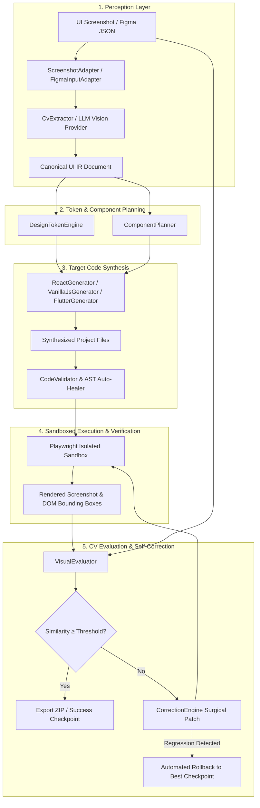

# AIUI — Autonomous UI-to-Code Engineering Agent

[](https://react.dev)
[](https://www.typescriptlang.org)
[](https://vitejs.dev)
[](https://playwright.dev)

> **AIUI** is an autonomous engineering agent that takes UI screenshots or Figma designs and compiles them into frontend code through an iterative perception, generation, sandboxing, and visual self-correction loop.

---

## ⚡ Quick Start

Launch AIUI locally:

```bash
# Clone the repository
git clone https://github.com/VoidVedh/AIUI.git
cd AIUI

# 1-Click Launch (installs dependencies, builds packages, and opens browser)
./start.sh
```

The web studio opens automatically at **`http://localhost:5173`**.

📖 **Looking for a beginner, non-technical guide?** Read [**docs/how-to-use.md**](docs/how-to-use.md).

---

## 🏗️ Architecture & Pipeline Flow

AIUI enforces a separation of concerns via an **Intermediate Representation (UI IR)** layer. Visual perception and code generation are decoupled, allowing multi-target code synthesis from a single unified schema.



---

## 📊 Feature Status

| Target / Feature | Status | Details |
| :--- | :--- | :--- |
| **React 19 (`@aiui/core`)** | Active | Playwright sandbox rendering, visual diffing, AST validation, and standalone Vite builds. |
| **Vanilla JS (`@aiui/core`)** | Active | Generates semantic HTML5 markup, CSS3 custom properties design tokens, and vanilla DOM manipulation scripts. |
| **Flutter (`@aiui/core`)** | Generator Implemented | Produces compilable Dart widget trees (`StatelessWidget`, `Scaffold`, `AppBar`, `Card`, `ElevatedButton`) & `pubspec.yaml`. Live browser sandboxing requires local Flutter SDK CLI on PATH. |
| **Figma Adapter (`@aiui/core`)** | Implemented | Parses Figma REST API JSON trees into canonical UI IR. |
| **Self-Correction Engine** | Active | Evaluates MSSIM, PixelMatch, and Layout IoU, generating data-driven surgical CSS/JSX patches with automatic regression rollback. |
| **Web Studio Dashboard** | Active | Interactive Split Slider, Side-by-Side viewer, CV Diff Heatmap, live console logs, Syntax-highlighted Code Explorer, and ZIP export. |

---

## 🤖 AI Provider Ecosystem

AIUI supports provider-agnostic visual perception and iterative self-correction:

```
AIUI Pipeline
 ├── OpenRouter (Gemma / Claude / GPT)
 ├── Puter → Gemini (Free tier, zero Google API key required)
 ├── Google Gemini (Direct API)
 ├── OpenAI (GPT-4o)
 ├── Anthropic (Claude 3.5 Sonnet)
 └── Offline CV Engine (Deterministic fallback)
```

---

## 🧪 Benchmark Verification

> **Disclaimer**: Scores vary by input. Login/auth archetypes historically score lowest. See live verification section below.

Benchmark suites have been organized into:
- **`benchmarks/internal/`**: Monorepo fixtures covering distinct archetype structures (auth, cards, forms, dashboards, dense tables).
- **`benchmarks/external/`**: Real-world external screenshots for generalization testing without engineered priors.

Detailed execution traces and baseline tracking are documented in [**docs/external-benchmark-baseline.md**](docs/external-benchmark-baseline.md) and [**docs/test-results.md**](docs/test-results.md).

---

## ⚠️ Known Limitations

1. **Login & Auth Archetypes**:
   - Authentication and login screens featuring centered auth cards, stacked input fields, submit buttons, and secondary links have historically exhibited lower initial visual scores (MSSIM ~35%, PixelMatch ~5%).
   - The self-correction engine requires accurate centroid measurement and data-driven color sampling to align inputs and buttons without visual distortion.
2. **Flutter Web Execution**:
   - The `FlutterGenerator` synthesizes syntactically valid Dart widget files and `pubspec.yaml`.
   - Automated visual evaluation of Flutter requires a host environment with the official Flutter SDK installed (`flutter build web`).
3. **Figma Vector Geometry**:
   - `FigmaInputAdapter` imports frames, nested component instances, text styles, and auto-layout flexbox properties.
   - Complex compound bezier paths (`BOOLEAN_OPERATION`) map to semantic icon archetypes with bounding-box preservation rather than arbitrary SVG vector curves.
4. **Host Environment & Browser Dependencies**:
   - Headless evaluation relies on Playwright Chromium. If Chromium binaries are missing on macOS or Linux, a fail-fast preflight alert informs the operator (`npx playwright install chromium`) instead of hanging.

---

## 📦 Monorepo Package Structure

```
aiui/
├── packages/
│   ├── core/           # UI IR Schema, Input Adapters, Token Engine, Code Generators
│   ├── evaluator/      # MSSIM, PixelDiff, Layout Bounding Box IoU, Aggregate Scorer
│   ├── runner/         # Process-isolated Playwright sandbox & headless Vite renderer
│   ├── orchestrator/   # Pipeline state machine, Self-correction engine, Regression rollback
│   ├── server/         # Express API, SSE stream, Artifacts server, Zip packager
│   └── web/            # Vite + React 19 Studio Dashboard
├── benchmarks/         # Internal and external benchmark targets
│   ├── internal/       # Core archetype fixtures
│   └── external/       # Held-out real-world targets
├── docs/               # Architecture, guides, and progress documentation
├── scripts/            # Launch runner and verification scripts
└── start.sh            # Launch script
```

---

## 💻 Developer Commands

```bash
# Install all workspace dependencies
npm install

# Build all monorepo packages
npm run build --workspaces

# Run typecheck
npx tsc --noEmit

# Run unit and integration tests
npm test
```

---

## 📄 License

MIT © 2026 AIUI Team.
