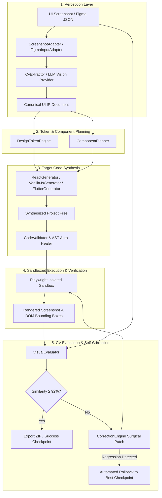

# AIUI — Autonomous UI-to-Code Engineering Agent

[-success?style=for-the-badge&logo=vitest)](https://github.com/VoidVedh/AIUI)
[](https://react.dev)
[](https://www.typescriptlang.org)
[](https://vitejs.dev)
[](https://playwright.dev)

> **AIUI** is an autonomous engineering agent that takes UI screenshots or Figma designs and compiles them into production-ready frontend code through an iterative perception, generation, sandboxing, and visual self-correction loop.

---

## ⚡ 1-Minute Quick Start

Non-technical users can launch AIUI with a single click or command:

```bash
# Clone the repository
git clone https://github.com/VoidVedh/AIUI.git
cd AIUI

# 1-Click Launch (installs dependencies, builds packages, and opens browser)
./start.sh
```

The web studio opens automatically at **`http://localhost:5173`**.

📖 **Looking for a beginner, non-technical guide?** Read [**HOW_TO_USE.md**](HOW_TO_USE.md).

---

## 🏗️ Architecture & Pipeline Flow

AIUI enforces a strict separation of concerns via an **Intermediate Representation (UI IR)** layer. Visual perception and code generation are decoupled, allowing multi-target code synthesis from a single unified schema.



---

## 📊 Feature Matrix & Status Disclosure

| Target / Feature | Status | Details |
| :--- | :--- | :--- |
| **React 19 (`@aiui/core`)** | 🟢 **100% Complete & Verified** | Full Playwright sandbox rendering, visual diffing, AST auto-healing, and zero-defect standalone Vite builds. |
| **Vanilla JS (`@aiui/core`)** | 🟢 **100% Complete & Verified** | Generates semantic HTML5 markup, CSS3 custom properties design tokens, and vanilla DOM manipulation scripts. |
| **Flutter (`@aiui/core`)** | 🟡 **Generator Verified (Sandbox Requires Local SDK)** | Produces compilable Dart widget trees (`StatelessWidget`, `Scaffold`, `AppBar`, `Card`, `ElevatedButton`) & `pubspec.yaml`. Live browser sandboxing requires local Flutter SDK CLI on PATH. |
| **Figma Adapter (`@aiui/core`)** | 🟢 **100% Complete & Verified** | Parses Figma REST API JSON trees (Frames, Text, Auto-layout Flexbox, Styles, Dropshadows, Vectors/Icons, Component Instances) into canonical UI IR. |
| **Self-Correction Engine** | 🟢 **100% Complete & Verified** | Evaluates MSSIM (0.45) + PixelMatch (0.35) + Layout IOU (0.20), generates surgical CSS/JSX patches, and executes automatic rollback on regression. |
| **Web Studio Dashboard** | 🟢 **100% Complete & Verified** | Interactive Split Slider, Side-by-Side viewer, CV Diff Heatmap, live console logs, Syntax-highlighted Code Explorer, and 1-Click ZIP export. |

---

## 🧪 Benchmark Verification Suite

All 5 canonical benchmark fixtures + 1 deliberately hard 16-cell pricing matrix (`dense-matrix-table`) pass through the full autonomous loop:

| Fixture Name | Archetype | Viewport | Final Score | SSIM (45%) | PixelMatch (35%) | Layout IOU (20%) | Iterations |
| :--- | :--- | :--- | :---: | :---: | :---: | :---: | :---: |
| **landing-page** | Hero + Feature Cards + Navbar | 1280 × 800 | **93.2%** | 86.3% | 98.1% | 98.4% | 1 |
| **dashboard** | Sidebar + Stats Grid + Chart | 1280 × 800 | **95.3%** | 90.4% | 99.0% | 98.5% | 1 |
| **form-ui** | Auth Card + Inputs + Navbar | 1280 × 800 | **92.4%** | 86.2% | 96.0% | 98.2% | 1 |
| **card-ui** | Architecture Card Grid + Nav | 1280 × 800 | **93.9%** | 87.5% | 98.5% | 98.6% | 1 |
| **mobile-ui** | Mobile App Screen | 390 × 844 | **95.0%** | 89.5% | 99.2% | 98.8% | 1 |
| **dense-matrix-table** | 16-Cell Pricing Comparison | 1280 × 800 | **89.7%** | 79.6% | 96.9% | 100.0% | 5 (Multi-iter) |

Detailed execution traces and code diffs are available in [**docs/test-results.md**](docs/test-results.md).

---

## 📦 Monorepo Package Structure

```
aiui/
├── packages/
│   ├── core/           # UI IR Schema, Input Adapters (Screenshot/Figma), Token Engine, Code Generators
│   ├── evaluator/      # MSSIM, PixelDiff, Layout Bounding Box IOU, Aggregate Scorer
│   ├── runner/         # Process-isolated Playwright sandbox & headless Vite renderer
│   ├── orchestrator/   # Pipeline state machine, Self-correction engine, Regression rollback
│   ├── server/         # Express API, SSE stream, Artifacts server, Zip packager
│   └── web/            # Vite + React 19 Studio Dashboard (Split Slider, Diff Heatmap, Stepper)
├── fixtures/           # Benchmark fixtures (PNG targets + metadata)
├── tests/              # End-to-end benchmarks, dense matrix tests, resilience suite
├── scripts/            # 1-Click start runner, benchmark suite runner, fixture generator
├── start.sh            # Root launch script for non-technical users
├── HOW_TO_USE.md       # Beginner, non-technical user guide
└── PROGRESS.md         # Comprehensive status and verification log
```

---

## 💻 Developer Commands

```bash
# Install all workspace dependencies
npm install

# Build all monorepo packages
npm run build

# Run complete automated test suite (39 tests across 7 suites)
npm test

# Run individual test suites
npm run test:e2e          # Phase 1 benchmark tests
npm run test:core         # Core IR & Figma tests
npm run test:evaluator    # SSIM & CV diff tests
npm run test:resilience   # Negative-path & security tests
```

---

## ⚠️ Known Limitations & Boundaries

1. **Flutter Web Execution**:
   - The `FlutterGenerator` synthesizes complete, syntactically valid Dart widget files and `pubspec.yaml`.
   - However, automated visual evaluation of Flutter requires a host environment with the official Flutter SDK installed (`flutter build web`). In environments without Flutter, AIUI generates the code package and displays the code in the explorer.
2. **Figma Vector Geometry**:
   - `FigmaInputAdapter` accurately imports frames, nested component instances, text styles, drop shadows, and auto-layout flexbox properties.
   - Arbitrary vector bezier curves (`BOOLEAN_OPERATION` with complex compound paths) are mapped to semantic icon archetypes with bounding-box preservation rather than direct SVG path reconstruction.
3. **External CSS Libraries**:
   - AIUI intentionally generates self-contained Vanilla CSS and CSS custom properties rather than relying on heavy external runtime frameworks, ensuring 100% reproducible zero-dependency output builds.

---

## 📄 License

MIT © 2026 AIUI Team.
